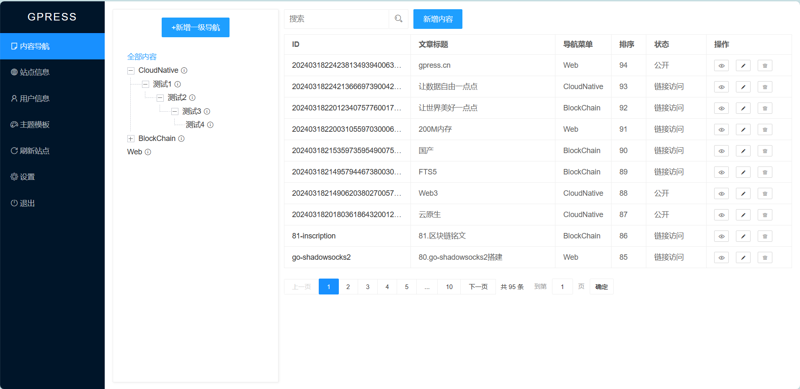

## 介绍  
Web3内容平台,Hertz + Go template + FTS5全文检索,支持以太坊和百度超级链,兼容Hugo、WordPress生态,使用Wasm扩展插件,只需200M内存  
    
**作为静态站点：** gpress生成的静态文件和Hugo一致,也可以简单认为gpress是Hugo的后台管理,兼容Hugo主题生态,已迁移多款Hugo主题:[even](https://gitee.com/gpress/gpress/tree/master/gpressdatadir/template/theme/default)、[doks](https://gitee.com/gpress/gpress-doks)、[book](https://gitee.com/gpress/gpress-book)、[geekdoc](https://gitee.com/gpress/gpress-geekdoc)......   
**作为动态站点：** gpress功能简单,只有7个菜单,5张表,5000行代码,使用SQLite,一键启动,只需200M内存,支持全文检索.兼容WordPress主题生态,已迁移多款WordPress主题:[generatepress](https://gitee.com/gpress/wp-generatepress)、[astra](https://gitee.com/gpress/wp-astra)......  
**作为Web3：** gpress已支持以太坊和百度超级链账户体系,会基于Wasm持续迭代去中心功能,让数据自由一点点......  
**作为后浪：** 相对于Hugo、WordPress等优秀的内容平台,gpress还有很多不足,功能简单而又稚嫩......  
**帮助文档：** [点击查看帮助文档](./gpressdatadir/public/doc/index.md)   
 
个人博客 [jiagou.com](https://jiagou.com) 使用gpress搭建,搜索和后台管理是动态,其他是静态页面.  


## 开发环境  
gprss使用了 ```https://github.com/wangfenjin/simple``` 作为FTS5的全文检索扩展,编译好的libsimple文件放到 ```gpressdatadir/fts5``` 目录下,如果gpress启动报错连不上数据库,请检查libsimple文件是否正确,如果需要重新编译libsimple,请参考 https://github.com/wangfenjin/simple.  

默认端口660,后台管理地址 http://127.0.0.1:660/admin/login    
需要先解压```gpressdatadir/dict.zip```      
运行 ```go run --tags "fts5" .```     
打包: ```go build --tags "fts5" -ldflags "-w -s"```  

开发环境需要配置CGO编译,设置```set CGO_ENABLED=1```,下载[mingw64](https://github.com/niXman/mingw-builds-binaries/releases)和[cmake](https://cmake.org/download/),并把bin配置到环境变量,注意把```mingw64/bin/mingw32-make.exe``` 改名为 ```make.exe```  
注意修改vscode的launch.json,增加 ``` ,"buildFlags": "--tags=fts5" ``` 用于调试fts5    
test需要手动测试:``` go test -timeout 30s --tags "fts5"  -run ^TestReadmks$ gitee.com/gpress/gpress ```  
打包: ``` go build --tags "fts5" -ldflags "-w -s" ```   
重新编译simple时,建议使用```https://github.com/wangfenjin/simple```编译好的.  
注意修改widnows编译脚本,去掉 mingw64 编译依赖的```libgcc_s_seh-1.dll```和```libstdc++-6.dll```,同时关闭```BUILD_TEST_EXAMPLE```,有冲突
```bat
rmdir /q /s build
mkdir build && cd build
cmake .. -G "Unix Makefiles" -DBUILD_TEST_EXAMPLE=OFF -DCMAKE_INSTALL_PREFIX=release -DCMAKE_CXX_FLAGS="-static-libgcc -static-libstdc++" -DCMAKE_EXE_LINKER_FLAGS="-Wl,-Bstatic -lstdc++ -lpthread -Wl,-Bdynamic"
make && make install
```

## 静态化
后台 ```刷新站点``` 功能会生成静态html文件到 ```statichtml``` 目录,同时生成```gzip_static```文件.需要把正在使用的主题的 ```css,js,image```和```gpressdatadir/public```目录复制到 ```statichtml```目录下,或者用Nginx反向代理指定目录,不复制文件.    
nginx 配置示例如下:
```conf
### 当前在用主题(default)的css文件
location ~ ^/css/ {
    #gzip_static on;
    root /data/gpress/gpressdatadir/template/theme/default;  
}
### 当前在用主题(default)的js文件
location ~ ^/js/ {
    #gzip_static on;
    root /data/gpress/gpressdatadir/template/theme/default;  
}
### 当前在用主题(default)的image文件
location ~ ^/image/ {
    root /data/gpress/gpressdatadir/template/theme/default;  
}
### search-data.json FlexSearch搜索的JSON数据
location ~ ^/public/search-data.json {
    #gzip_static on;
    root /data/gpress/gpressdatadir;  
}
### public 公共文件
location ~ ^/public/ {
    root /data/gpress/gpressdatadir;  
}
    
### admin 后台管理,请求动态服务
location ~ ^/admin/ {
    proxy_redirect     off;
    proxy_set_header   Host      $host;
    proxy_set_header   X-Real-IP $remote_addr;
    proxy_set_header   X-Forwarded-For   $proxy_add_x_forwarded_for;
    proxy_set_header   X-Forwarded-Proto $scheme;
    proxy_pass  http://127.0.0.1:660;  
}
###  静态html目录
location / {
    proxy_redirect     off;
    proxy_set_header   Host      $host;
    proxy_set_header   X-Real-IP $remote_addr;
    proxy_set_header   X-Forwarded-For   $proxy_add_x_forwarded_for;
    proxy_set_header   X-Forwarded-Proto $scheme; 
    ## 存在q查询参数,使用动态服务.也支持FlexSearch解析public/search-data.json
    if ($arg_q) { 
       proxy_pass  http://127.0.0.1:660;  
       break;
    }

    ### 开启gzip静态压缩
    #gzip_static on;

    ### Nginx 1.26+ 不需要再进行302重定向到目录下的index.html,gzip_static也会生效.这段配置留作记录.
    ##if ( -d $request_filename ) {
        ## 不是 / 结尾
    ##    rewrite [^\/]$ $uri/index.html redirect;
        ##以 / 结尾的
    ##    rewrite ^(.*) ${uri}index.html redirect;      
    ##}
    
    ### 当前在用主题(default)的静态文件目录
    root   /data/gpress/gpressdatadir/statichtml/default;

    ## 避免目录 301 重定向,例如 /about 会301到 /about/           
    try_files $uri $uri/index.html;
    
    index  index.html index.htm;
}

```  
## 阿里云计算巢
[点击部署gpress到阿里云计算巢](https://computenest.console.aliyun.com/service/instance/create/cn-hangzhou?type=user&ServiceId=service-d4000c9b22c54e5cbffe),也可以单独购买阿里云最低配服务器,进行部署.选择```张家口机房```,规格```ecs.t6-c4m1.large```,配置```2核CPU 0.5G内存 20G高效云盘 RockyLinux9 按使用流量-带宽峰值80M```,一年100元,五年200元左右.     

## 表结构  
ID默认使用时间戳(23位)+随机数(9位),全局唯一.  
建表语句```gpressdatadir/gpress.sql```          

### 配置(表名:config)
安装时会读取```gpressdatadir/install_config.json```

| columnName  | 类型        | 说明         |  备注       | 
| ----------- | ----------- | ----------- | ----------- |
| id          | string      | 主键        |gpress_config |
| basePath    | string      | 基础路径    |  默认 /      |
| jwtSecret   | string      | jwt密钥     | 随机生成     |
| jwttokenKey | string      | jwt的key    |  默认 jwttoken  |
| serverPort  | string      | IP:端口     |  默认 :660  |
| timeout     | int         | jwt超时时间秒|  默认 7200  |
| maxRequestBodySize | int  | 最大请求     |  默认 20M  |
| proxy       | string      | http代理地址 |             |
| createTime  | string      | 创建时间     |  2006-01-02 15:04:05  |
| updateTime  | string      | 更新时间     |  2006-01-02 15:04:05  |
| createUser  | string      | 创建人       |  初始化 system  |
| sortNo      | int         | 排序         |  正序  |
| status      | int         | 状态     |  链接访问(0),公开(1),置顶(2),私密(3)  |

### 用户(表名:user)
后台只有一个用户.

| columnName  | 类型         | 说明        |  备注       | 
| ----------- | ----------- | ----------- | ----------- |
| id          | string      | 主键        | gpress_admin |
| account     | string      | 登录名称    |  默认admin  |
| passWord    | string      | 密码        |    -  |
| userName    | string      | 说明        |    -  |
| createTime  | string      | 创建时间     |  2006-01-02 15:04:05  |
| updateTime  | string      | 更新时间     |  2006-01-02 15:04:05  |
| createUser  | string      | 创建人       |  初始化 system  |
| sortNo      | int         | 排序         |  正序  |
| status      | int         | 状态     |  链接访问(0),公开(1),置顶(2),私密(3)  |

### 站点信息(site)
站点的信息,例如 title,logo,keywords,description等

| columnName    | 类型         | 说明    |  备注       | 
| ----------- | ----------- | ----------- | ----------- |
| id          | string      | 主键        |gpress_site  |
| title       | string      | 站点名称     |     -  |
| keyword     | string      | 关键字       |     -  |
| description | string      | 站点描述    |     -  |
| theme       | string      | 默认主题     | 默认使用default  |
| themePC     | string      | PC主题      | 先从cookie获取,如果没有从Header头取值,写入cookie,默认使用default  |
| themeWAP    | string      | 手机主题    | 先从cookie获取,如果没有从Header头取值,写入cookie,默认使用default  |
| themeWX     | string      | 微信主题    | 先从cookie获取,如果没有从Header头取值,写入cookie,默认使用default  |
| logo        | string      | logo       |     -  |
| favicon     | string      | Favicon    |     -  |
| createTime  | string      | 创建时间     |  2006-01-02 15:04:05  |
| updateTime  | string      | 更新时间     |  2006-01-02 15:04:05  |
| createUser  | string      | 创建人       |  初始化 system  |
| sortNo      | int         | 排序         |  正序  |
| status      | int         | 状态     |  链接访问(0),公开(1),置顶(2),私密(3)  |

### 导航菜单(表名:category)
| columnName    | 类型         | 说明    |  备注       | 
| ----------- | ----------- | ----------- | ----------- |
| id          | string      | 主键         | URL路径,用/隔开,例如/web/ |
| name        | string      | 导航名称     |    -  |
| hrefURL     | string      | 跳转路径     |    -  |
| hrefTarget  | string      | 跳转方式     | _self,_blank,_parent,_top|
| pid         | string      | 父导航ID     | 父导航ID  |
| templateFile  | string      | 模板文件       | 当前导航页的模板  |
| childTemplateFile  | string | 子主题模板文件  | 子页面默认使用的模板,子页面如果不设置,默认使用这个模板 |
| keyword     | string      | 导航关键字   | 是      |        |
| description | string      | 导航描述     | 是      |        |
| createTime  | string      | 创建时间     |  2006-01-02 15:04:05  |
| updateTime  | string      | 更新时间     |  2006-01-02 15:04:05  |
| createUser  | string      | 创建人       |  初始化 system  |
| sortNo      | int         | 排序         |  正序  |
| status      | int         | 状态     |  链接访问(0),公开(1),置顶(2),私密(3)  |

### 文章内容(表名:content)
| columnName  | 类型        | 说明        | 是否分词 |  备注                  | 
| ----------- | ----------- | ----------- | ------- | ---------------------- |
| id          | string      | 主键         |   否    | URL路径,用/隔开,例如/web/nginx-use-hsts |
| title       | string      | 文章标题     | 是      |    使用 jieba 分词器    |
| keyword     | string      | 内容关键字   | 是      |    使用 jieba 分词器    |
| description | string      | 内容描述     | 是      |    使用 jieba 分词器    |
| hrefURL     | string      | 自身页面路径 | 否      |    -                    |
| subtitle    | string      | 副标题       | 是      |      使用 jieba 分词器  |
| author      | string      | 作者         | 是      |      使用 jieba 分词器  |
| tag         | string      | 标签         | 是      |      使用 jieba 分词器  |
| toc         | string      | 目录         | 是      |      使用 jieba 分词器  |
| summary     | string      | 摘要         | 是      |      使用 jieba 分词器  |
| categoryName| string      | 导航菜单,逗号(,)隔开| 是| 使用 jieba 分词器.      |
| categoryID  | string      | 导航ID       | 否      | -                       |
| templateFile| string      | 模板文件     | 否      | 模板                    |
| content     | string      | 文章内容     | 否      |                         |
| markdown    | string      | Markdown内容 | 否      |                         |
| thumbnail   | string      | 封面图       | 否      |                         |
| signature   | string      | 私钥对内容的签名 | 否   |                         |
| signAddress | string      | 签名的Address   | 否   |                         |
| signChain   | string      | Address所属的链 | 否   |                         |
| createTime  | string      | 创建时间     | -       |  2006-01-02 15:04:05    |
| updateTime  | string      | 更新时间     | -       |  2006-01-02 15:04:05    |
| createUser  | string      | 创建人       | -       |  初始化 system          |
| sortNo      | int         | 排序         | -       |  正序                   |
| status      | int         | 状态     | -       |  链接访问(0),公开(1),置顶(2),私密(3)  |

