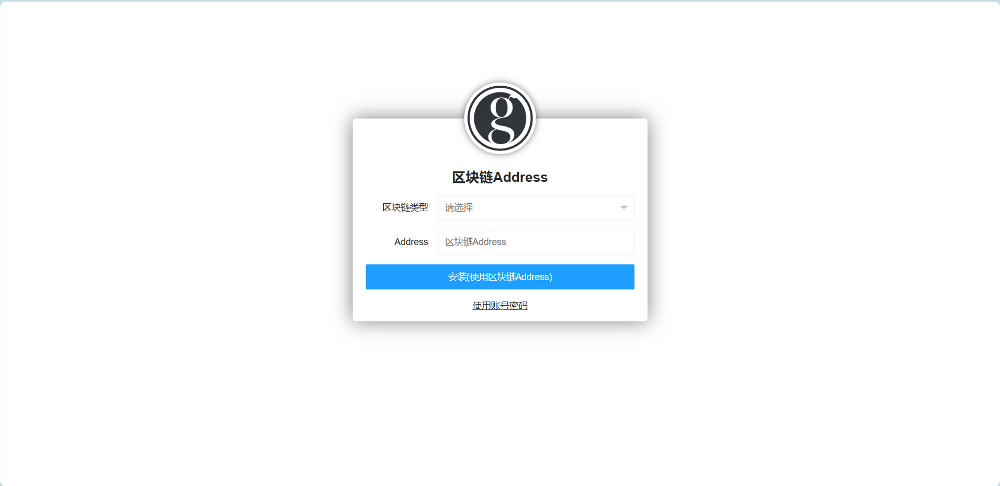
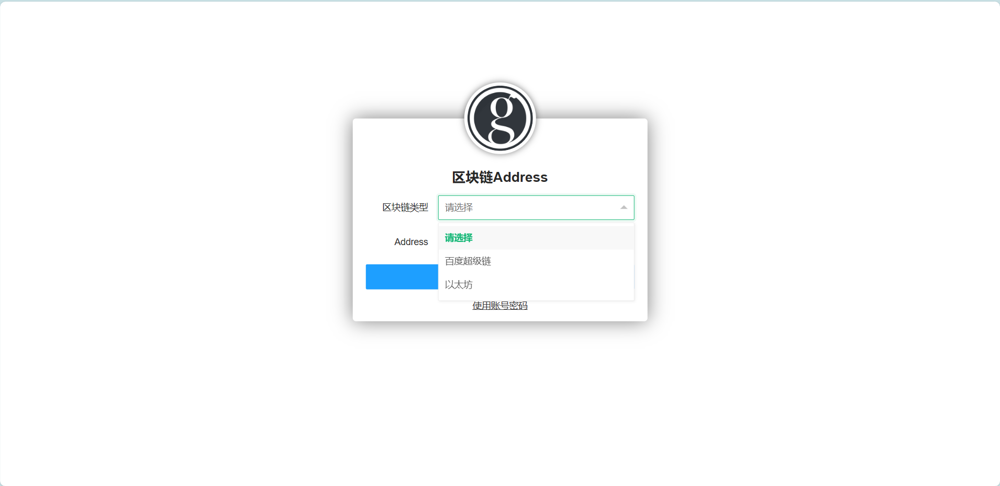
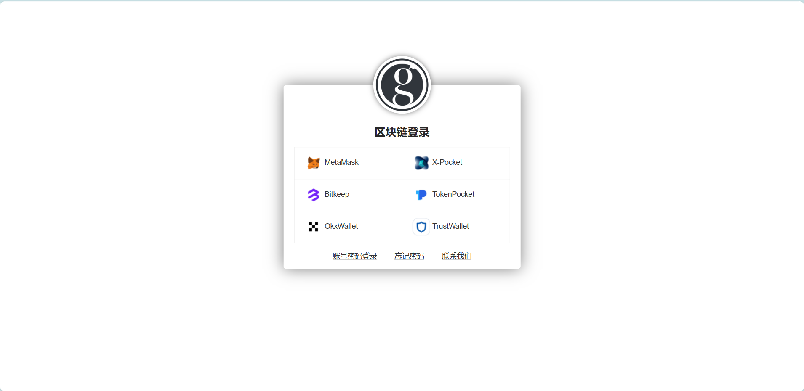
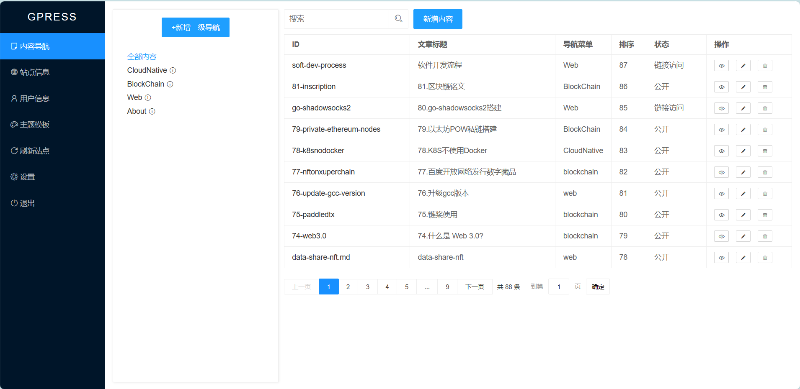
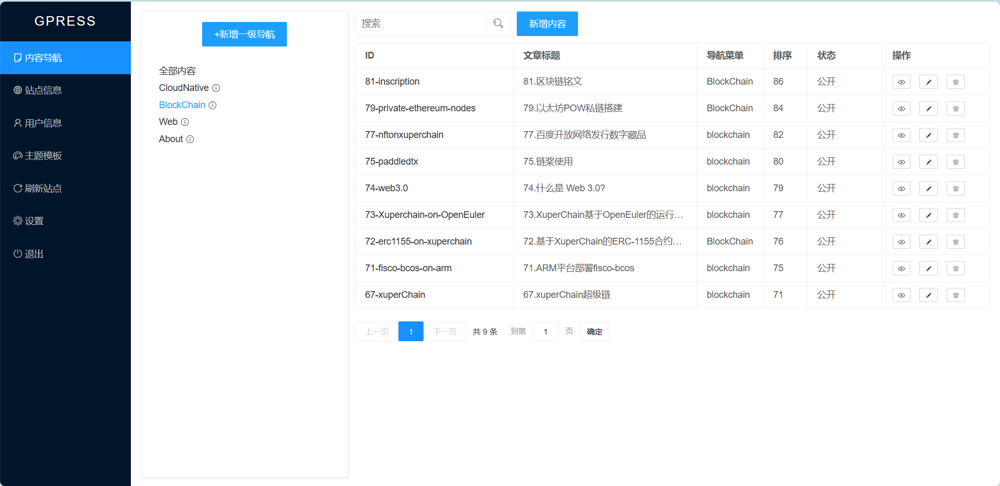

# gpress帮助文档

## 简介
Web3内容平台,Hertz + Go template + FTS5全文检索,支持以太坊和百度超级链,兼容hugo生态,使用Wasm扩展插件,只需200M内存  

## 安装
运行gpress,会输出访问的路径,根据提示使用浏览器访问 ```http://127.0.0.1:660/admin/login``` 首次运行会进入安装界面.  
  
首次运行gpress,一定要先进行安装设置管理员的账号密码.安装界面如下图:
  
输入管理员账号和密码,即完成安装,同时支持区块链账号Address作为管理员用户
  
目前支持以太坊和百度超级链,推荐使用[X-Pocket钱包](https://github.com/shengjian-tech/X-Pocket)  
  

## 登录
浏览器访问 ```http://127.0.0.1:660/admin/login```,正常显示登录页面,输入安装时设置的账号密码.

同时支持使用区块链钱包进行授权登录  


## 内容导航
登录之后,默认查看内容导航功能,左侧是导航菜单,右侧是文章内容  
  
新增一级导航,就是新增上级为空的导航,会跳转到新增导航界面.  
选中导航,字体颜色为蓝色,右侧显示改导航下的内容,如下图示例,选中```BlockChain```导航   
  
导航后面有功能提示的图标,鼠标悬浮显示功能菜单.  
  
有以下四个功能:
- 新增内容:为该导航新增文章内容
- 新增子导航:在该导航下新增子导航
- 编辑导航: 编辑该导航
- 删除导航: 删除该导航


