# gpress帮助文档

## 简介
Web3内容平台,Hertz + Go template + FTS5全文检索,支持以太坊和百度超级链,兼容Hugo、WordPress生态,使用Wasm扩展插件,只需200M内存  

## 安装
运行gpress,会输出访问的路径,根据提示使用浏览器访问 ```http://127.0.0.1:660/admin/login``` 首次运行会进入安装界面.  
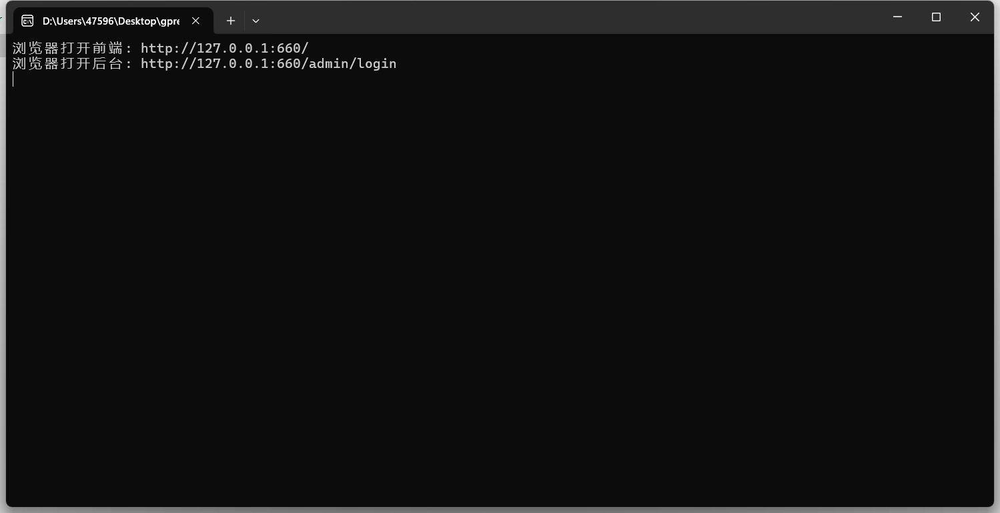  
首次运行gpress,一定要先进行安装设置管理员的账号密码.安装界面如下图:
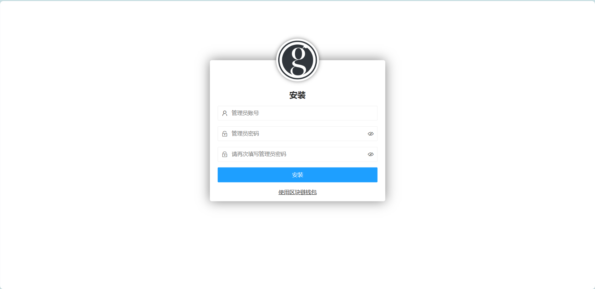  
输入管理员账号和密码,即完成安装,同时支持区块链账号Address作为管理员用户
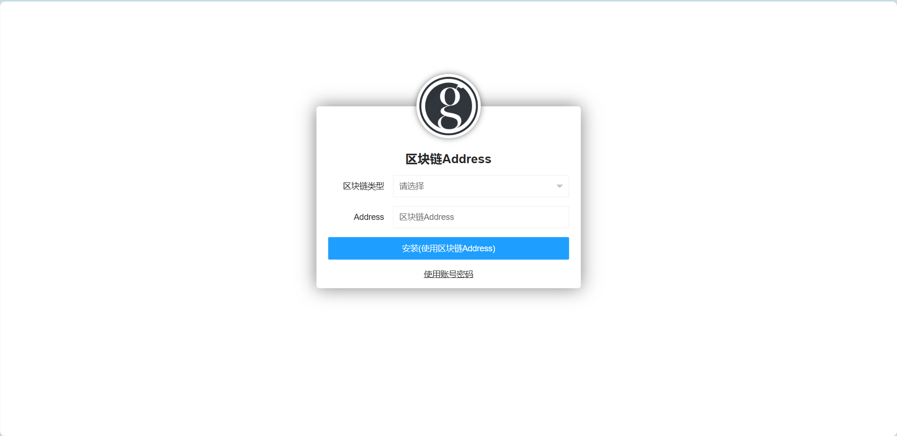  
目前支持以太坊和百度超级链,推荐使用[X-Pocket钱包](https://github.com/shengjian-tech/X-Pocket)  
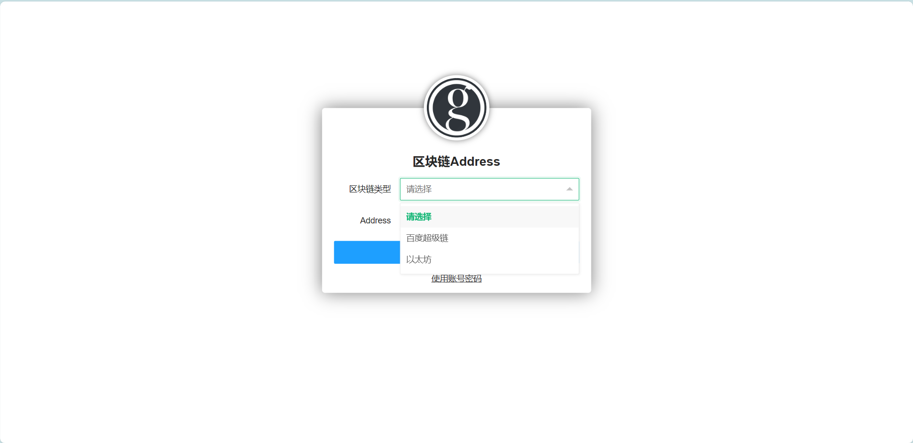  

## 登录
浏览器访问 ```http://127.0.0.1:660/admin/login```,正常显示登录页面,输入安装时设置的账号密码.
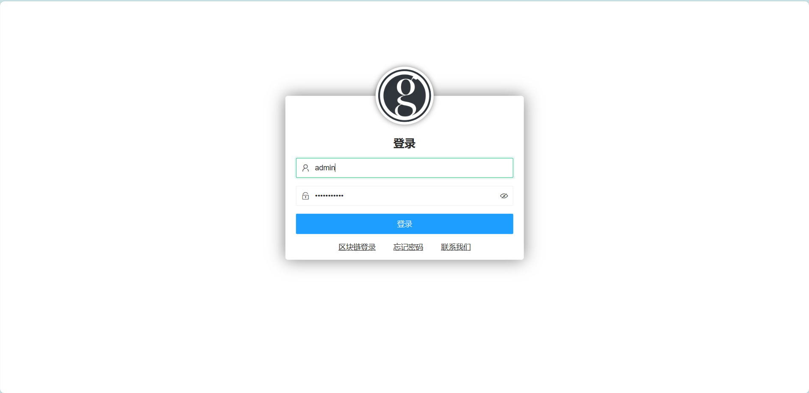  
同时支持使用区块链钱包进行授权登录  
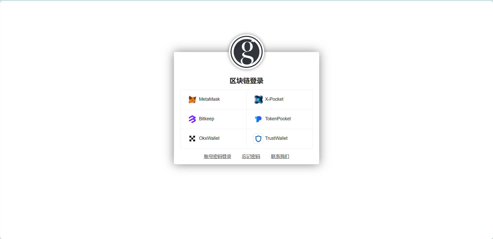  

## 内容导航
登录之后,默认查看内容导航功能,左侧是导航菜单,右侧是文章内容  
  
新增一级导航,就是新增上级为空的导航,会跳转到新增导航界面.  
选中导航,字体颜色为蓝色,右侧显示改导航下的内容,如下图示例,选中```BlockChain```导航   
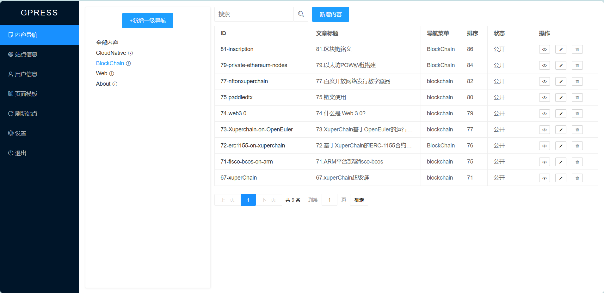  
导航后面有功能提示的图标,鼠标悬浮显示功能菜单.  
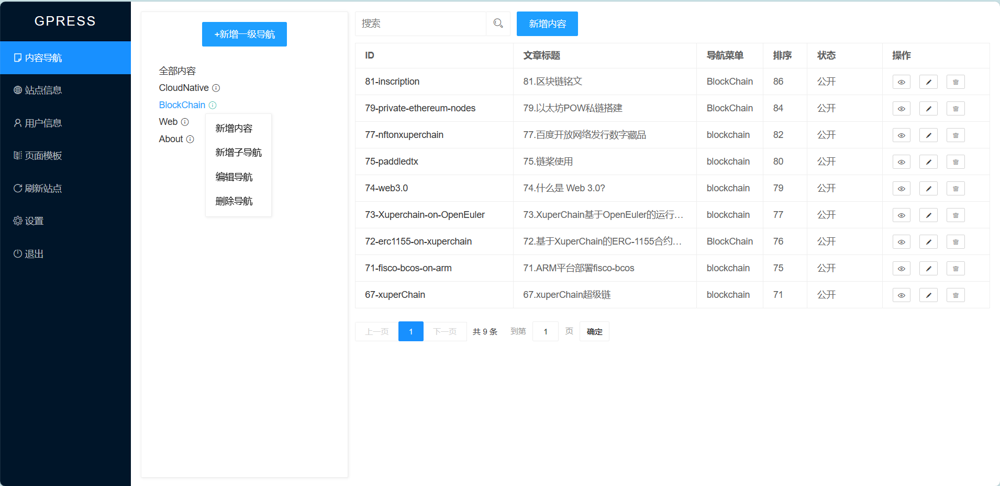  
有以下四个功能:
- 新增内容:为该导航新增文章内容
- 新增子导航:在该导航下新增子导航
- 编辑导航: 编辑该导航
- 删除导航: 删除该导航  
新增子导航的功能界面如下:    
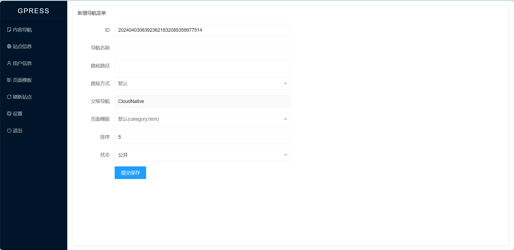        
编辑导航的功能界面如下:      
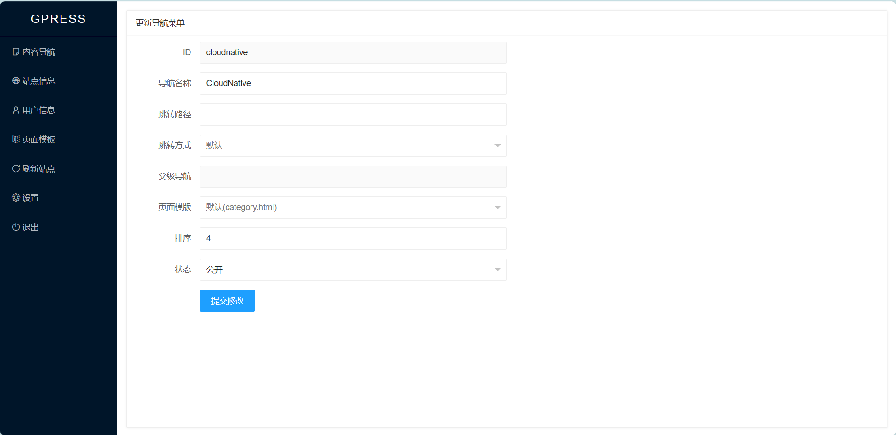      
删除导航的功能界面如下:      
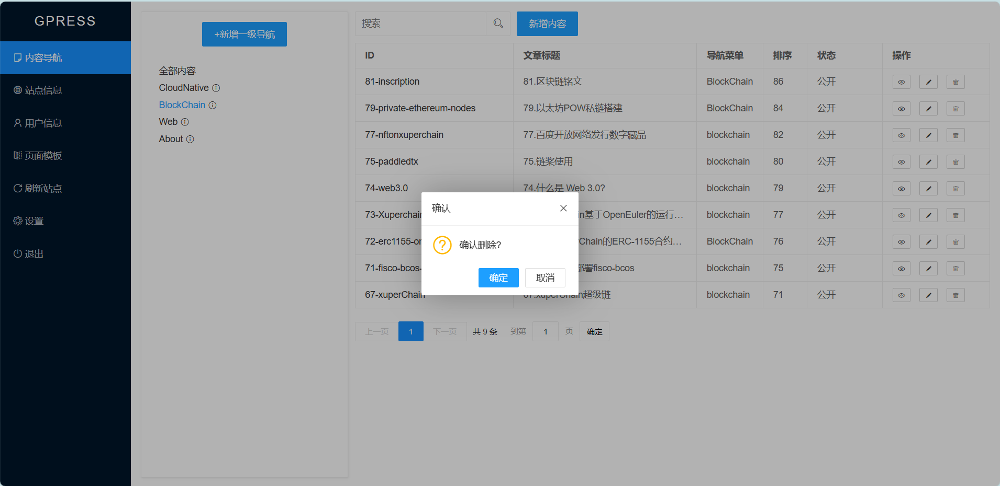      

## 新增/修改内容
内容管理是gpress的重要功能,新增内容主要设置内容的ID,标题和归属的导航菜单,ID会出现在URL中,且不可更改,例如 ID为```gpress```,访问路径为```http://127.0.0.1:660/web/gpress```.内容有```Markdown```和```富文本```两种格式,根据场景选择使用.
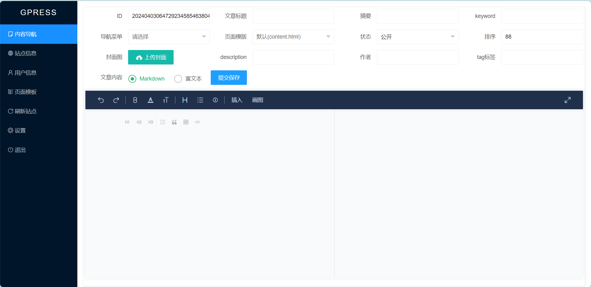
## 内容列表
界面左侧为内容列表,点击```ID```会跳转到前台界面,操作有```预览```,```编辑```和```删除```.```预览```是管理员查看实时数据,通过```ID```跳转的前台界面可能有静态化缓存.
内容列表有基于```fts5```实现的全文检索功能,输入关键字,点击搜索图标,完成搜索.  
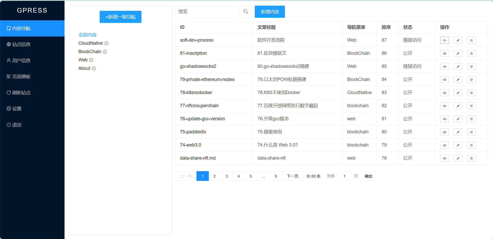  
## 站点信息
设置站点的基础内容信息,其中主题是读取```gpressdatadir/template/theme```目录下的主题文件夹,更换主题之后,需要点击```刷新站点```功能,刷新前台界面. ```logo```是前台界面显示的logo,后台的logo固定为```gpress```的logo,暂时不支持更改. 
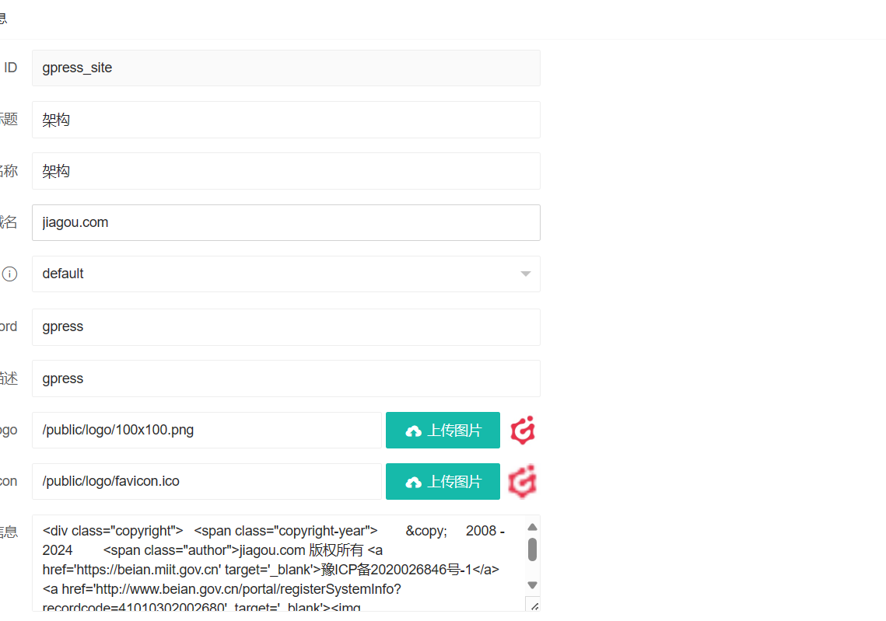  
## 用户信息
修改管理员的账号信息,功能界面如下:  
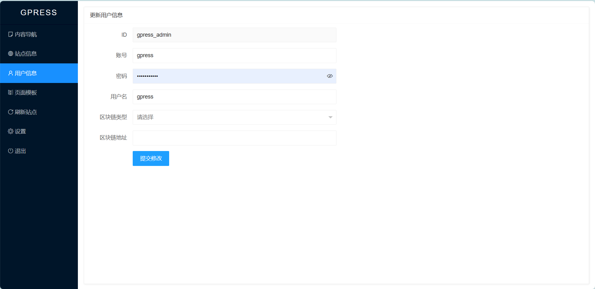
## 主题模板
主题模板的增删改查功能,管理主题中的自定义模板文件,修改内容和导航菜单时,可以应用自定义的模板文件.  
  
支持上传主题zip压缩包,用于新增主题.   
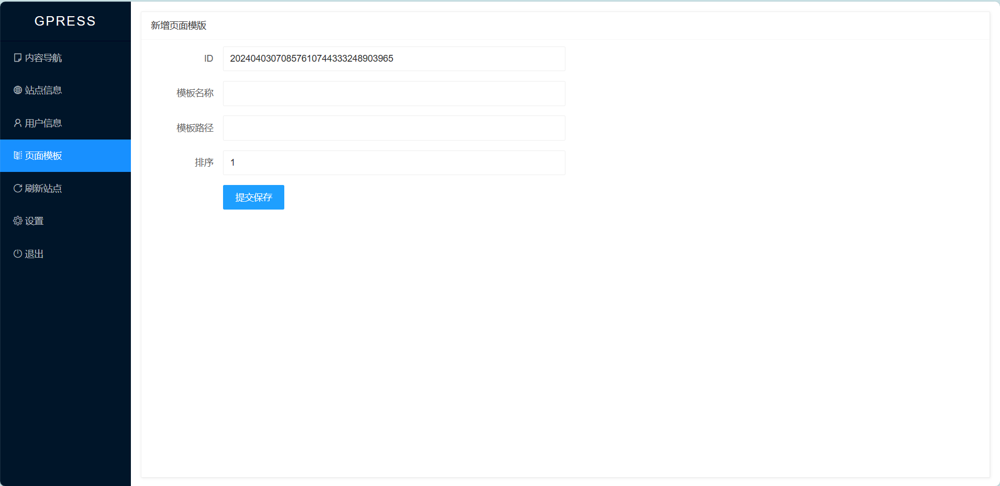  
可以从```主题市场```中下载主题,进行安装  
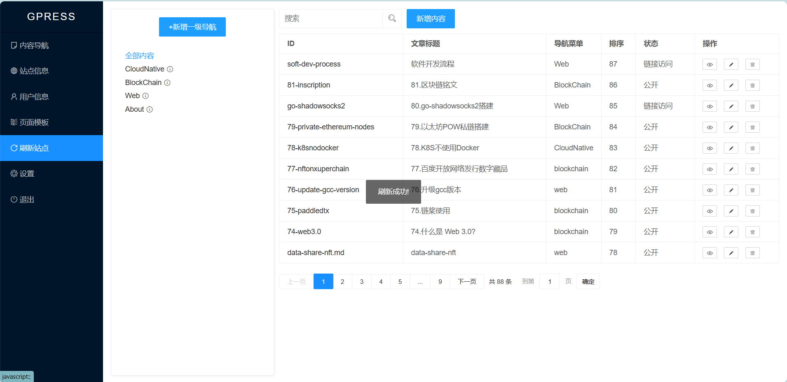  

## 刷新站点
模板更改时需要刷新站点才能生效,同时刷新站点会生成静态文件,用于```Nginx```静态化访问.
```刷新站点``` 功能会生成静态html文件到 ```statichtml``` 目录,同时生成```gzip_static```文件,需要把正在使用的主题的 ```css,js,image```和```gpressdatadir/public```目录复制到 ```statichtml```目录下,也可以用Nginx反向代理指定目录.    
nginx 配置示例如下:
```conf
### 当前在用主题(default)的css文件
location ~ ^/css/ {
    #gzip_static on;
    root /data/gpress/gpressdatadir/template/theme/default;  
}
### 当前在用主题(default)的js文件
location ~ ^/js/ {
    #gzip_static on;
    root /data/gpress/gpressdatadir/template/theme/default;  
}
### 当前在用主题(default)的image文件
location ~ ^/image/ {
    root /data/gpress/gpressdatadir/template/theme/default;  
}
### search-data.json FlexSearch搜索的JSON数据
location ~ ^/public/search-data.json {
    #gzip_static on;
    root /data/gpress/gpressdatadir;  
}
### public 公共文件
location ~ ^/public/ {
    root /data/gpress/gpressdatadir;  
}
    
### admin 后台管理,请求动态服务
location ~ ^/admin/ {
    proxy_redirect     off;
    proxy_set_header   Host      $host;
    proxy_set_header   X-Real-IP $remote_addr;
    proxy_set_header   X-Forwarded-For   $proxy_add_x_forwarded_for;
    proxy_set_header   X-Forwarded-Proto $scheme;
    proxy_pass  http://127.0.0.1:660;  
}
###  静态html目录
location / {
    proxy_redirect     off;
    proxy_set_header   Host      $host;
    proxy_set_header   X-Real-IP $remote_addr;
    proxy_set_header   X-Forwarded-For   $proxy_add_x_forwarded_for;
    proxy_set_header   X-Forwarded-Proto $scheme; 
    ## 存在q查询参数,使用动态服务.也支持FlexSearch解析public/search-data.json
    if ($arg_q) { 
       proxy_pass  http://127.0.0.1:660;  
       break;
    }

    ### 开启gzip静态压缩
    #gzip_static on;

    ### Nginx 1.26+ 不需要再进行302重定向到目录下的index.html,gzip_static也会生效.这段配置留作记录.
    ##if ( -d $request_filename ) {
        ## 不是 / 结尾
    ##    rewrite [^\/]$ $uri/index.html redirect;
        ##以 / 结尾的
    ##    rewrite ^(.*) ${uri}index.html redirect;      
    ##}
    
    ### 当前在用主题(default)的静态文件目录
    root   /data/gpress/gpressdatadir/statichtml/default;
    
    ## 避免目录 301 重定向,例如 /about 会301到 /about/           
    try_files $uri $uri/index.html;

    index  index.html index.htm;
}

```  
    

## 设置
用于系统设置,需要重启gpress才能生效.  
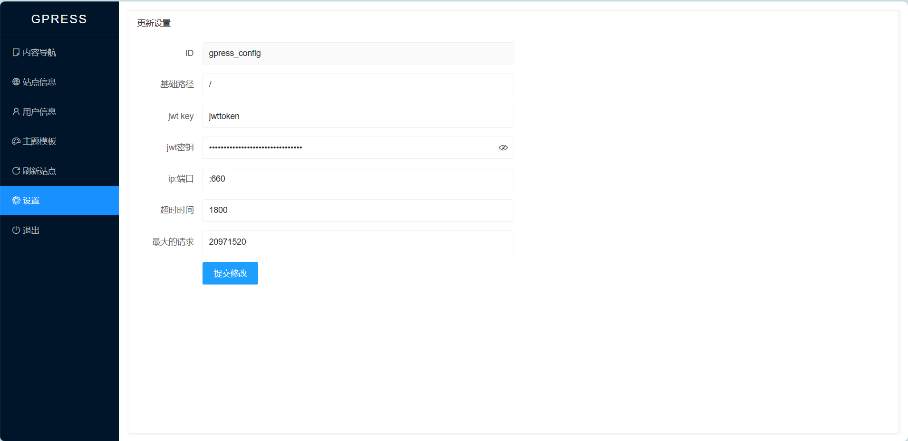    

## 退出
退出管理后台

## 标签函数
[标签函数](./tagfunction/README.md)