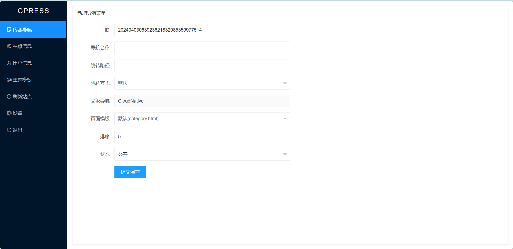
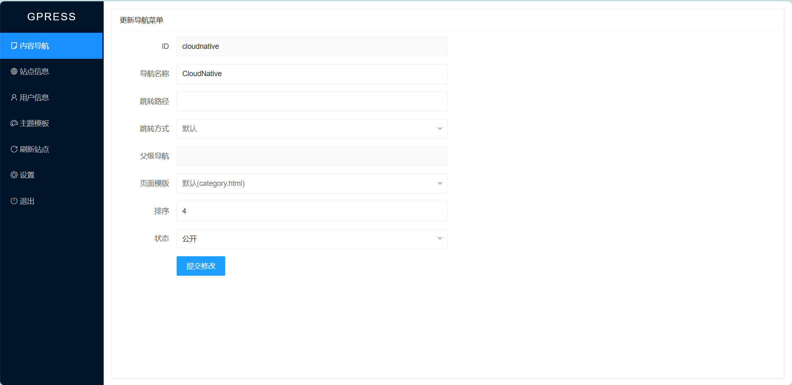
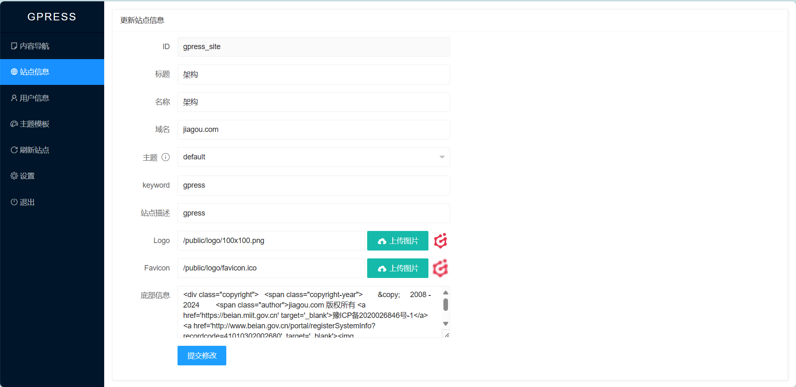
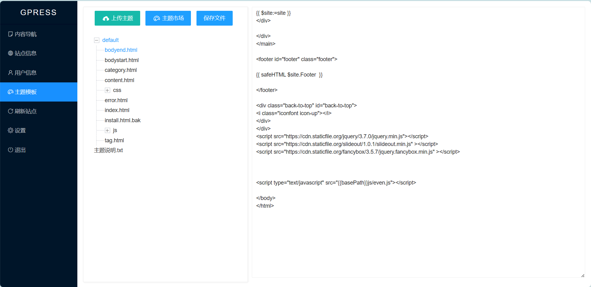
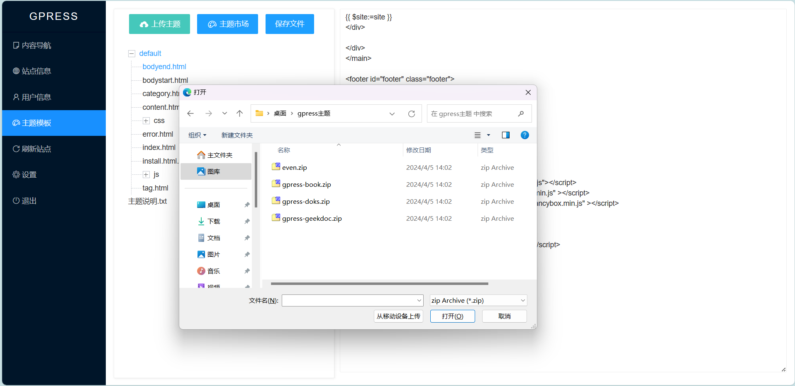
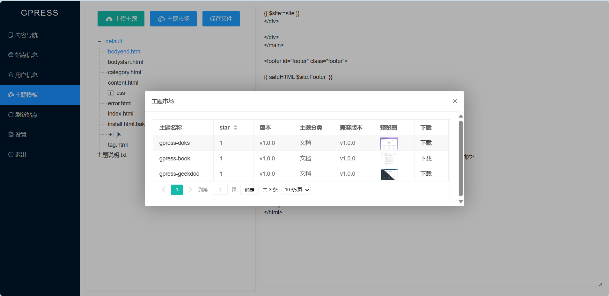
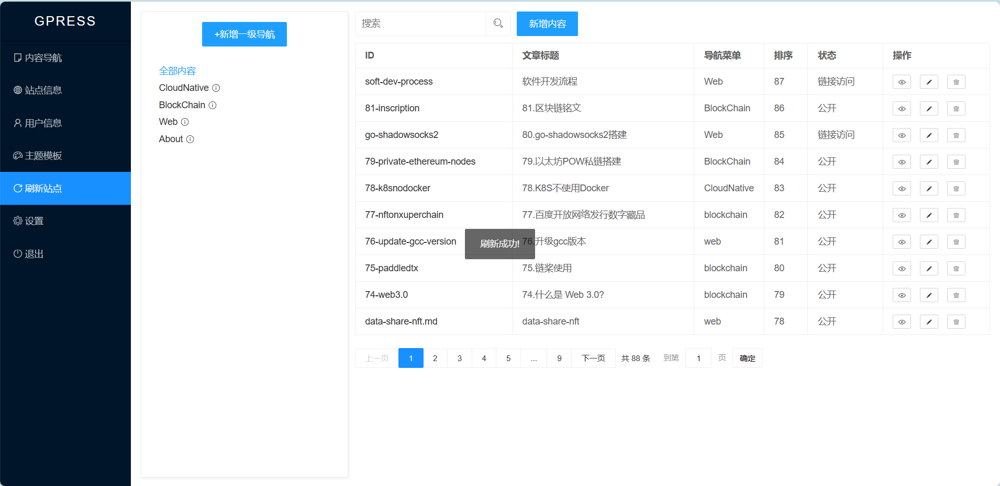

# gpress帮助文档

## 简介
Web3内容平台,Hertz + Go template + FTS5全文检索,支持以太坊和百度超级链,兼容hugo生态,使用Wasm扩展插件,只需200M内存  

## 安装
运行gpress,会输出访问的路径,根据提示使用浏览器访问 ```http://127.0.0.1:660/admin/login``` 首次运行会进入安装界面.  
  
首次运行gpress,一定要先进行安装设置管理员的账号密码.安装界面如下图:
  
输入管理员账号和密码,即完成安装,同时支持区块链账号Address作为管理员用户
  
目前支持以太坊和百度超级链,推荐使用[X-Pocket钱包](https://github.com/shengjian-tech/X-Pocket)  
  

## 登录
浏览器访问 ```http://127.0.0.1:660/admin/login```,正常显示登录页面,输入安装时设置的账号密码.
  
同时支持使用区块链钱包进行授权登录  
  

## 内容导航
登录之后,默认查看内容导航功能,左侧是导航菜单,右侧是文章内容  
  
新增一级导航,就是新增上级为空的导航,会跳转到新增导航界面.  
选中导航,字体颜色为蓝色,右侧显示改导航下的内容,如下图示例,选中```BlockChain```导航   
  
导航后面有功能提示的图标,鼠标悬浮显示功能菜单.  
  
有以下四个功能:
- 新增内容:为该导航新增文章内容
- 新增子导航:在该导航下新增子导航
- 编辑导航: 编辑该导航
- 删除导航: 删除该导航  
新增子导航的功能界面如下:    
        
编辑导航的功能界面如下:      
      
删除导航的功能界面如下:      
      

## 新增/修改内容
内容管理是gpress的重要功能,新增内容主要设置内容的ID,标题和归属的导航菜单,ID会出现在URL中,且不可更改,例如 ID为```about```,访问路径为```http://127.0.0.1:660/post/about```.内容有```Markdown```和```富文本```两种格式,根据场景选择使用.

## 内容列表
界面左侧为内容列表,点击```ID```会跳转到前台界面,操作有```预览```,```编辑```和```删除```.```预览```是管理员查看实时数据,通过```ID```跳转的前台界面可能有静态化缓存.
内容列表有基于```fts5```实现的全文检索功能,输入关键字,点击搜索图标,完成搜索.  
  
## 站点信息
设置站点的基础内容信息,其中主题是读取```gpressdatadir/template/theme```目录下的主题文件夹,更换主题之后,需要点击```刷新站点```功能,刷新前台界面. ```logo```是前台界面显示的logo,后台的logo固定为```gpress```的logo,暂时不支持更改. 
  
## 用户信息
修改管理员的账号信息,功能界面如下:  

## 主题模板
主题模板的增删改查功能,管理主题中的自定义模板文件,修改内容和栏目时,可以应用自定义的模板文件.  
  
支持上传主题zip压缩包,用于新增主题.   
  
可以从```主题市场```中下载主题,进行安装  
  

## 刷新站点
模板更改时需要刷新站点才能生效,同时刷新站点会生成静态文件,用于```Nginx```静态化访问.
```刷新站点``` 功能会生成静态html文件到 ```statichtml``` 目录,同时生成```gzip_static```文件,需要把正在使用的主题的 ```css,js,image```和```gpressdatadir/public```目录复制到 ```statichtml```目录下,也可以用Nginx反向代理指定目录.    
nginx 配置示例如下:
```conf
### 当前在用主题(default)的css文件
location ~ ^/css/ {
    #gzip_static on;
    root /data/gpress/gpressdatadir/template/theme/default;  
}
### 当前在用主题(default)的js文件
location ~ ^/js/ {
    #gzip_static on;
    root /data/gpress/gpressdatadir/template/theme/default;  
}
### 当前在用主题(default)的image文件
location ~ ^/image/ {
    root /data/gpress/gpressdatadir/template/theme/default;  
}
### search-data.json FlexSearch搜索的JSON数据
location ~ ^/public/search-data.json {
    #gzip_static on;
    root /data/gpress/gpressdatadir;  
}
### public 公共文件
location ~ ^/public/ {
    root /data/gpress/gpressdatadir;  
}
    
### admin 后台管理,请求动态服务
location ~ ^/admin/ {
    proxy_redirect     off;
    proxy_set_header   Host      $host;
    proxy_set_header   X-Real-IP $remote_addr;
    proxy_set_header   X-Forwarded-For   $proxy_add_x_forwarded_for;
    proxy_set_header   X-Forwarded-Proto $scheme;
    proxy_pass  http://127.0.0.1:660;  
}
###  静态html目录
location / {
    proxy_redirect     off;
    proxy_set_header   Host      $host;
    proxy_set_header   X-Real-IP $remote_addr;
    proxy_set_header   X-Forwarded-For   $proxy_add_x_forwarded_for;
    proxy_set_header   X-Forwarded-Proto $scheme; 
    ## 存在q查询参数,使用动态服务.也支持FlexSearch解析public/search-data.json
    if ($arg_q) { 
       proxy_pass  http://127.0.0.1:660;  
       break;
    }

    #### gzip 静态压缩配置 开始####
    #gzip_static on;
    ## 请求的是个目录,302重定向到 目录下的 index.html
    #if ( -d $request_filename ) {
        ## 不是 / 结尾
    #    rewrite [^\/]$ $uri/index.html redirect;
        ##以 / 结尾的
    #    rewrite ^(.*) ${uri}index.html redirect;      
    #}
    #### gzip 静态压缩配置 结束####

    
    root   /data/gpress/gpressdatadir/statichtml;
    index  index.html index.htm;
}

```  
    

## 设置
用于系统设置,需要重启gpress才能生效.  
    

## 退出
退出管理后台

## 功能/表字段说明
ID默认使用时间戳(23位)+随机数(9位),全局唯一.  
建表语句```gpressdatadir/gpress.sql```          

### 配置(表名:config)
安装时会读取```gpressdatadir/install_config.json```

| columnName  | 类型        | 说明         |  备注       | 
| ----------- | ----------- | ----------- | ----------- |
| id          | string      | 主键        |gpress_config |
| basePath    | string      | 基础路径    |  默认 /      |
| jwtSecret   | string      | jwt密钥     | 随机生成     |
| jwttokenKey | string      | jwt的key    |  默认 jwttoken  |
| serverPort  | string      | IP:端口     |  默认 :660  |
| timeout     | int         | jwt超时时间秒|  默认 1800  |
| maxRequestBodySize| int   | 最大请求|  默认 20M  |
| proxy       | string      | http代理地址 |             |
| createTime  | string      | 创建时间     |  2006-01-02 15:04:05  |
| updateTime  | string      | 更新时间     |  2006-01-02 15:04:05  |
| createUser  | string      | 创建人       |  初始化 system  |
| sortNo      | int         | 排序         |  正序  |
| status      | int         | 状态     |  链接访问(0),公开(1),私密(2)  |

### 用户(表名:user)
后台只有一个用户.

| columnName  | 类型         | 说明        |  备注       | 
| ----------- | ----------- | ----------- | ----------- |
| id          | string      | 主键        | gpress_admin |
| account     | string      | 登录名称    |  默认admin  |
| passWord    | string      | 密码        |    -  |
| userName    | string      | 说明        |    -  |
| createTime  | string      | 创建时间     |  2006-01-02 15:04:05  |
| updateTime  | string      | 更新时间     |  2006-01-02 15:04:05  |
| createUser  | string      | 创建人       |  初始化 system  |
| sortNo      | int         | 排序         |  正序  |
| status      | int         | 状态     |  链接访问(0),公开(1),私密(2)  |

### 站点信息(site)
站点的信息,例如 title,logo,keywords,description等

| columnName    | 类型         | 说明    |  备注       | 
| ----------- | ----------- | ----------- | ----------- |
| id          | string      | 主键        |gpress_site  |
| title       | string      | 站点名称     |     -  |
| keyword     | string      | 关键字       |     -  |
| description | string      | 站点描述    |     -  |
| theme       | string      | 默认主题     | 默认使用default  |
| themePC     | string      | PC主题      | 先从cookie获取,如果没有从Header头取值,写入cookie,默认使用default  |
| themeWAP    | string      | 手机主题    | 先从cookie获取,如果没有从Header头取值,写入cookie,默认使用default  |
| themeWEIXIN | string      | 微信主题    | 先从cookie获取,如果没有从Header头取值,写入cookie,默认使用default  |
| logo        | string      | logo       |     -  |
| favicon     | string      | Favicon    |     -  |
| createTime  | string      | 创建时间     |  2006-01-02 15:04:05  |
| updateTime  | string      | 更新时间     |  2006-01-02 15:04:05  |
| createUser  | string      | 创建人       |  初始化 system  |
| sortNo      | int         | 排序         |  正序  |
| status      | int         | 状态     |  链接访问(0),公开(1),私密(2)  |

### 导航菜单(表名:category)
| columnName    | 类型         | 说明    |  备注       | 
| ----------- | ----------- | ----------- | ----------- |
| id          | string      | 主键        |    -  |
| name        | string      | 导航名称     |    -  |
| hrefURL     | string      | 跳转路径     |    -  |
| hrefTarget  | string      | 跳转方式     | _self,_blank,_parent,_top|
| pid         | string      | 父导航ID     | 父导航ID  |
| moduleID    | string      | module表ID   |  导航菜单下的文章默认使用的模型字段 |
| comCode     | string      | 逗号隔开的全路径 | 逗号隔开的全路径  |
| templateID  | string      | 模板Id       | 当前导航页的模板  |
| childTemplateID  | string | 子主题模板Id  | 子页面默认使用的模板,子页面如果不设置,默认使用这个模板 |
| createTime  | string      | 创建时间     |  2006-01-02 15:04:05  |
| updateTime  | string      | 更新时间     |  2006-01-02 15:04:05  |
| createUser  | string      | 创建人       |  初始化 system  |
| sortNo      | int         | 排序         |  正序  |
| status      | int         | 状态     |  链接访问(0),公开(1),私密(2)  |

### 文章内容(表名:content)
| columnName  | 类型        | 说明        | 是否分词 |  备注                  | 
| ----------- | ----------- | ----------- | ------- | ---------------------- |
| id          | string      | 主键         | 否      |    -                   |
| moduleID    | string      | 模型ID       | 否      |  文章使用的模型字段     |
| title       | string      | 文章标题     | 是      |    使用 jieba 分词器    |
| keyword     | string      | 关键字       | 是      |    使用 jieba 分词器    |
| description | string      | 站点描述     | 是      |    使用 jieba 分词器    |
| hrefURL     | string      | 自身页面路径 | 否      |    -                    |
| subtitle    | string      | 副标题       | 是      |      使用 jieba 分词器  |
| author      | string      | 作者         | 是      |      使用 jieba 分词器  |
| tag         | string      | 标签         | 是      |      使用 jieba 分词器  |
| toc         | string      | 目录         | 是      |      使用 jieba 分词器  |
| summary     | string      | 摘要         | 是      |      使用 jieba 分词器  |
| categoryName| string      | 导航菜单,逗号(,)隔开| 是| 使用 jieba 分词器.      |
| categoryID  | string      | 导航ID       | 否      | -                       |
| comCode     | string      | 逗号隔开的全路径 | 逗号隔开的全路径  |
| templateID  | string      | 模板Id       | 否      | 模板                    |
| content     | string      | 文章内容     | 否      |                         |
| markdown    | string      | Markdown内容 | 否      |                         |
| thumbnail   | string      | 封面图       | 否      |                         |
| createTime  | string      | 创建时间     | -       |  2006-01-02 15:04:05    |
| updateTime  | string      | 更新时间     | -       |  2006-01-02 15:04:05    |
| createUser  | string      | 创建人       | -       |  初始化 system          |
| sortNo      | int         | 排序         | -       |  正序                   |
| status      | int         | 状态     | -       |  链接访问(0),公开(1),私密(2)  |


