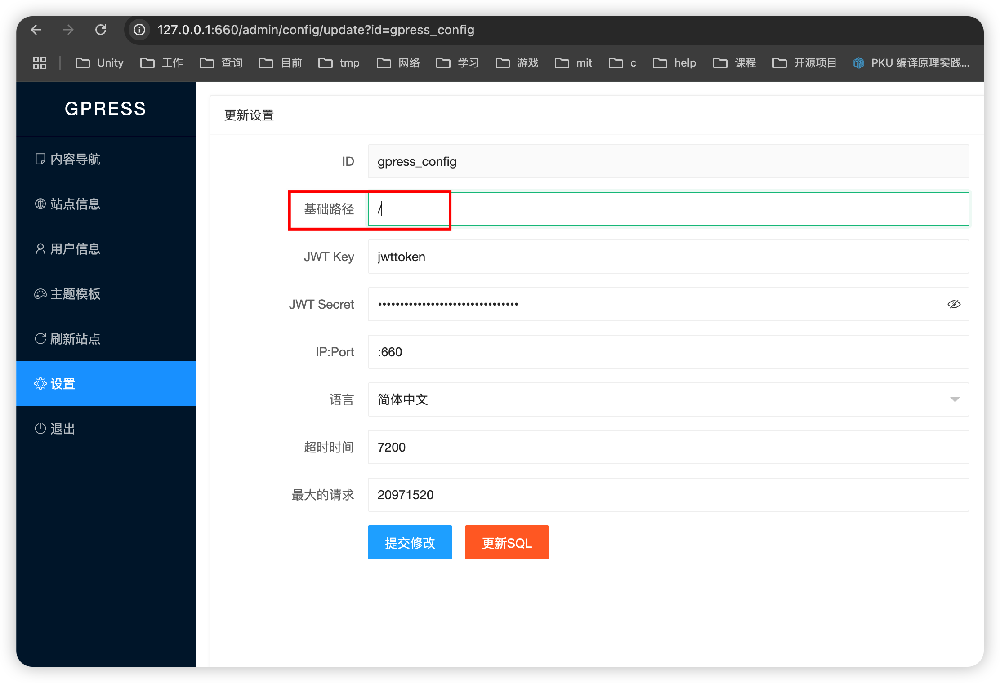
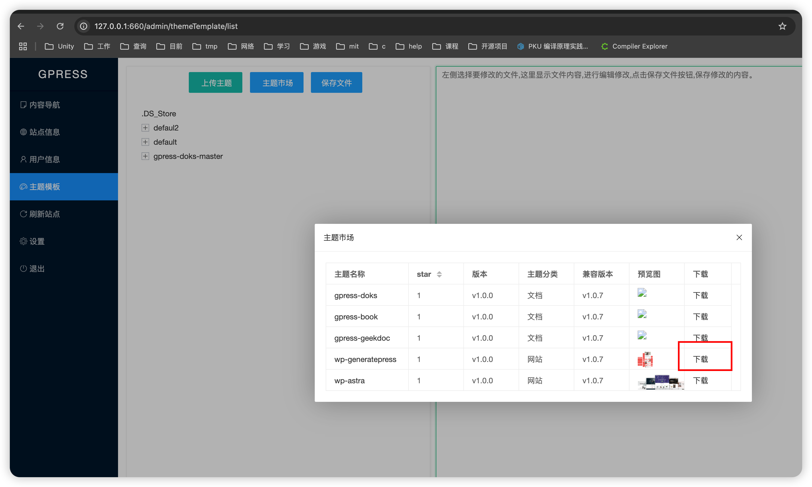
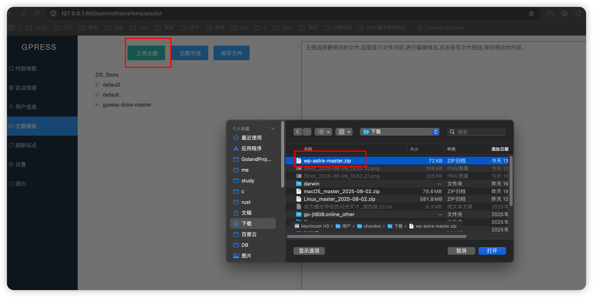

# gpress标签函数

## 1. 流程说明

| 文件名称  |   描述   |
| :---:   | -------- |
|  index.html | 模版固定从index.html加载 默认(template/theme/default/index.html)  |
|  category.html | 栏目模版名称,category开头  |
|  content.html | 内容模版名称,content开头 |
|  category-single.html | 单页的模版名称 |

- 根据go模版流程 从sqlite获取数据加载到页面 参考如下

```
{{ $site:=site }}
<!-- 查询 content 列表 -->
{{ $selectList := selectList "content" .q .pageNo 20 "* FROM content WHERE status in (1,2) order by  status desc,sortNo desc"  }}
{{ $basePath := basePath }}

<!DOCTYPE html>
<html lang="zh-cn">
<table class="content-table">
    <thead>
    <tr>
        <th>ID</th>
        <th>标题</th>
        <th>目录ID</th>
        <th>目录名称</th>
        <th>超链接</th>
    </tr>
    </thead>
    <tbody>
    {{ range $k, $v := $selectList.Data }}
        <tr>
            <td>{{ $v.Id }}</td>
            <td>{{ $v.Title }}</td>
            <td>{{ $v.CategoryID }}</td>
            <td>{{ $v.CategoryName }}</td>
            <td><a href="{{basePath}}{{ trimSlash $v.Id }}">{{ .Title }}</a></td>
        </tr>
    {{ end }}
    </tbody>
</table>

```

## 标签说明

- 定义的模版函数 [模版](https://gitee.com/gpress/gpress/blob/master/funcMap.go#L35)

标签说明:  
1. basePath 基础路径前缀
- 默认/ 可以在设置中修改


2. addInt int类型相加

3. addFloat float类型相加

4. convertType 类型转换

| 参数  |   说明   |
| :---:   | -------- |
|  value | 值 |
|  sourceType | 源类型  |
|  targetType | 目标类型 |

5. safeHTML HTML封装了一个已知的安全HTML文档片段
```
如数据<h1>Hello, World!</h1>
默认go模版转义后 -> &lt;h1&gt;Hello, World!&lt;/h1&gt;
```

6. safeURL URL封装了已知的安全URL或URL子字符串（见RFC 3986）
```
如数据 http://127.0.0.1:660/admin/config/update?id=gpress_config&key=1&value=2
默认go模版转义后 http://127.0.0.1:660/admin/config/update?id=gpress_config&amp;key=1&amp;value=2
```

7. hrefURL 获取跳转的href URL
```
路径修改为 basePath + id
/web/gpress -> / + web/gpress -> /web/gpress
如basePath修改为 /home/
/web/gpress -> /home/ + web/gpress -> /home/web/gpress
```
8. site 站点信息

```go
{{ $site:=site }}
//SELECT * FROM site  WHERE id=?
```
- 结果

``` json
{
  "id": "gpress_site",
  "title": "jiagou",
  "name": "架构",
  "domain": "https://jiagou.com",
  "keyword": "gpress,web3,Hugo,WordPress,以太坊,百度超级链",
  "description": "Web3内容平台,Hertz + Go template + FTS5全文检索,支持以太坊和百度超级链,兼容Hugo、WordPress生态,使用Wasm扩展插件,只需200M内存",
  "theme": "default",
  "themePC": "default",
  "themeWAP": "default",
  "themeWX": "default",
  "logo": "public/logo.png",
  "favicon": "public/favicon.png",
  "footer": "\u003cdiv class=\"copyright\"\u003e\u003cspan class=\"copyright-year\"\u003e\u0026copy; 2008 - 2025 \u003cspan class=\"author\"\u003ejiagou.com 版权所有 \u003ca href='https://beian.miit.gov.cn' target='_blank'\u003P备xxxxx号\u003c/a\u003e   \u003ca href='http://www.beian.gov.cn/portal/registerSystemInfo?recordcode=xxxx'  target='_blank'\u003e\u003cimg src='/public/gongan.png'\u003e豫公网安备xxxxx号\u003c/a\u003e\u003c/span\u003e\u003c/sp\u003c/div\u003e",
  "updateTime": "2025-08-06 12:39:03",
  "sortNo": 1,
  "status": 1
}

```

9. selectList 查询列表数据

| 参数  |   说明   |
| :---:   | -------- |
|  urlPathParam | 表名 |
|  q | 搜索关键字  |
|  pageNo | 页码 |
|  pageSize | 每页记录数，默认20 |
|  sql | sql语句 |
|  values | sql语句参数 |

```
如 {{ $selectList := selectList "content" .q .pageNo 20 "* FROM content WHERE status in (1,2) order by  status desc,sortNo desc"  }}
最终执行为 SELECT * FROM content WHERE status in (1,2) order by  status desc,sortNo desc LIMIT 0,20
```

10. selectOne 查询一条数据

| 参数  |   说明   |
| :---:   | -------- |
|  urlPathParam | 表名 |
|  sql | sql语句 |
|  values | sql语句参数 |

11. hasPrefix 是否某字符串开头

| 参数  |   说明   |
| :---:   | -------- |
|  s | 字符串 |
|  prefix | 前缀 |

12. hasSuffix 是否某字符串结尾

| 参数  |   说明   |
| :---:   | -------- |
|  s | 字符串 |
|  suffix | 后缀 |

13. contains 是否包含某字符串

| 参数  |   说明   |
| :---:   | -------- |
|  s | 字符串 |
|  substr | 某字符串 |

14. trimSuffixSlash 去掉开头/
```
/web/gpress/ -> web/gpress/
```

15. trimSlash 去掉前后的/
```
/web/gpress/ -> web/gpress
```

16. categoryURL 返回菜单url
```
/a/b/c -> a/b
```

17. firstURI 返回uri第一个
```
/a/b/c -> a
```

18. lastURI 返回uri最后一个
```
/a/b/c -> c
```

19. generateStringID 默认生成字符串ID的函数
```
年月日时分秒毫秒微秒纳秒 23位的字符串 + 9位随机数
如 20250806124834892793000533786562
```

20. treeCategory 导航菜单的树形结构

- 获取目录 在转为树形结构
```go
{{ $treeCategory := treeCategory "* from category WHERE status in (1,2) order by status desc,sortNo desc" }}

//SELECT * from category WHERE status in (1,2) order by status desc,sortNo desc
```
21. themeName 获取目录下的主题
- 读取主题目录 (gpressdatadir/template/theme/)
```
默认可以只有default 可以从主题商店下载并加入
[default]
```

- 下载主题



- 新增加下载的主题



```
注意macos系统的话 默认权限不够 可以用管理员权限运行gpress
或者直接解压压缩包到 gpressdatadir/template/theme/目录下
如测试的wp-astra-master -> gpressdatadir/template/theme/wp-astra-master
[default, wp-astra-master]
```

22. themeTemplate 获取主题模版匹配的html

| 参数  |   说明   |
| :---:   | -------- |
|  prefix | 匹配前缀 |

- prefix=body

``` json
[
  {
    "name": "bodyend.html",
    "filePath": "bodyend.html"
  },
  {
    "name": "bodystart.html",
    "filePath": "bodystart.html"
  }
]

```

23. version 获取版本
```
发布的版本 打tag的版本
可以在以下地址查看 https://gitee.com/gpress/gpress/releases
目前最新版本（2025.8.1）v1.1.3
```

24. T 根据配置的locale,获取语言包的值

- 在/gpressdatadir/locales下
- 初始化的时候 会根据当前使用的语言环境选择某个json文件

25. locale 当前使用的语言

| 参数  |   说明   |
| :---:   | -------- |
|  zh-CN | 中文 |
|  en-US | 英文 |

- 常用状态值说明

| 参数  |   说明   |
| :---:   | -------- |
|  userType | 0:访客 1:管理员 |
|  status | 1:公开 2:原私密 3:私有 |

## 查询栏目和内容
``` go
{{ $category := selectList "category" "" 1 1000 "* FROM category WHERE status in (1,2) order by status desc,sortNo desc" }}

{{ $content := selectOne "content" "* FROM content WHERE id=? order by sortNo desc" .UrlPathParam }}
```
